# 📁 Praktikum 3 : Data Manipulation Language

### [Kode Script SQL](./225150600111031_DevanF_Tugas3.sql)    

Berikut merupakan langkah-langkah untuk mengerjakan tugas praktikum bab 3 mata kuliah Desain dan Basis Data SQL mengenai Data Manipulation Language.

### 📝 Langkah Percobaan

1. Pertama-tama, kita akan membuat databasenya terlebih dahulu dengan nama 'akademik' lalu menggunakan database yang telah dibuat dengan syntax sebagai berikut.
```
CREATE DATABASE akademik;

USE akademik;
```
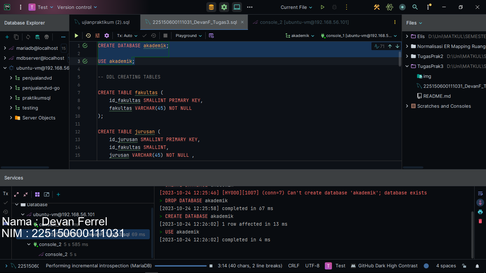
<br/>

2. Setelah membuat databasenya, kita akan membuat tabel-tabel yang ada sesuai dengan kriteria pada tugas. Tabel pertama yang kita buat adalah fakultas dengan syntax dan tipe datanya sebagai berikut.
```
CREATE TABLE fakultas (
    id_fakultas SMALLINT PRIMARY KEY,
    fakultas VARCHAR(45) NOT NULL
);
```
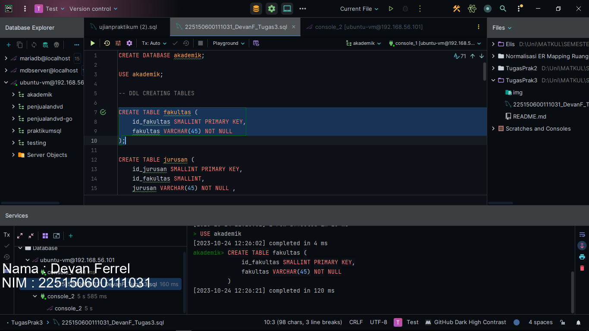
<br/>

3. Lalu tabel ke 2 yang kita buat adalah tabel jurusan, dimana tabel ini memiliki foreign key dengan nama id_fakultas yang direferensikan dari tabel fakultas yang telah kita buat. Oh ya, 1 hal lagi yang perlu kita ingat adalah kita harus membuat tabel yang direferensikan dari tabel lain terlebih dahulu supaya tidak error saat kita mereferensikannya.
```
CREATE TABLE jurusan (
    id_jurusan SMALLINT PRIMARY KEY,
    id_fakultas SMALLINT,
    jurusan VARCHAR(45) NOT NULL ,
    FOREIGN KEY(id_fakultas) REFERENCES fakultas(id_fakultas)
);
```
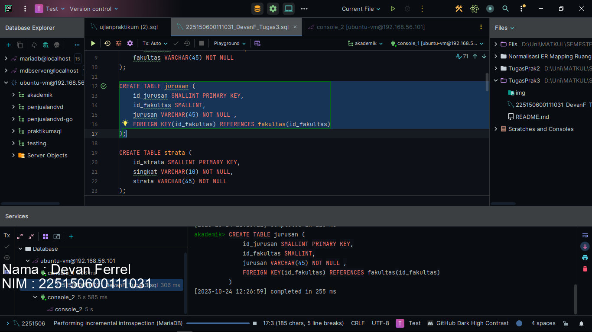
<br/>

4. Lalu tabel ke 3 yang kita buat adalah tabel strata dengan syntax dan tipe data setiap kolom sebagai berikut.
```
CREATE TABLE strata (
    id_strata SMALLINT PRIMARY KEY,
    singkat VARCHAR(10) NOT NULL,
    strata VARCHAR(45) NOT NULL
);
```
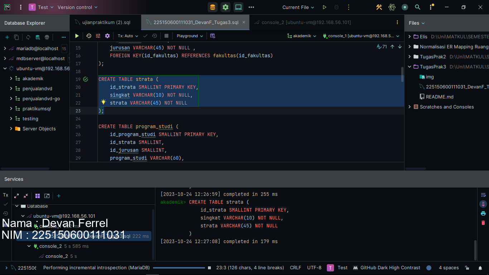
<br/>

5. Lalu tabel ke 4 yang kita buat adalah tabel program studi. Tabel ini memiliki 2 foregin key, yaitu id_strata dan id_jurusan. Foreign key id_strata kita dapatkan dari referensi tabel strata. Foreign key id_jurusan kita dapatkan dari referensi tabel jurusan. Kita buat dengan syntax seperti berikut.
```
CREATE TABLE program_studi (
    id_program_studi SMALLINT PRIMARY KEY,
    id_strata SMALLINT,
    id_jurusan SMALLINT,
    program_studi VARCHAR(60),
    FOREIGN KEY(id_strata) REFERENCES strata(id_strata),
    FOREIGN KEY(id_jurusan) REFERENCES jurusan(id_jurusan)
);
```
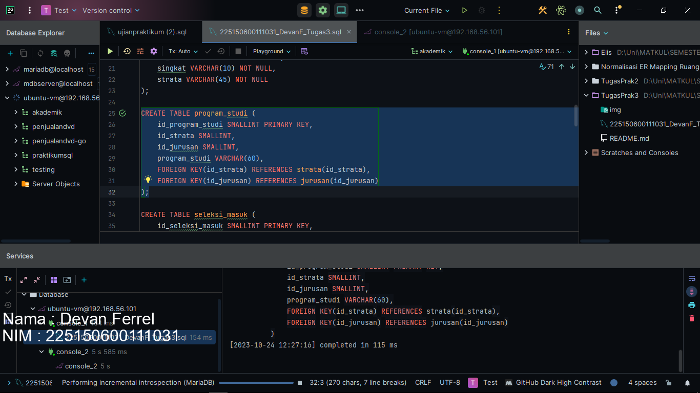
<br/>

6. Lalu tabel ke 5 yang kita buat adalah tabel seleksi masuk.  Kita buat dengan syntax beserta tipe datanya seperti berikut.
```
CREATE TABLE seleksi_masuk (
    id_seleksi_masuk SMALLINT PRIMARY KEY,
    singkat VARCHAR(12),
    seleksi_masuk VARCHAR(45)
);
```
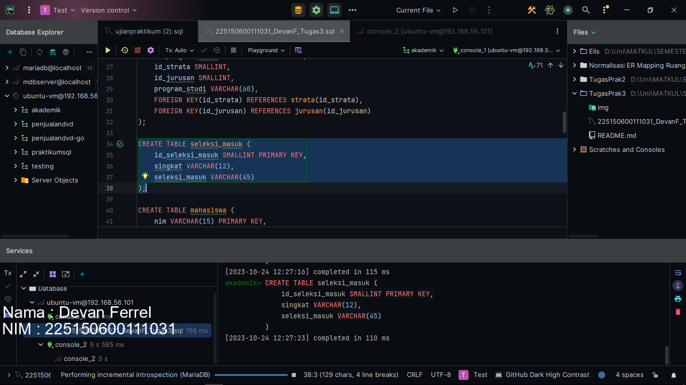
<br/>

7. Lalu tabel terakhir yang kita buat adalah tabel mahasiswa. Tabel mahasiswa memiliki 2 foreign key, yaitu id_seleksi_masuk dan id_program_studi. Foreign key id_seleksi_masuk kita referensikan dari tabel seleksi_masuk. Foreign key id_program_studi kita referensikand dari tabel program_studi Kita buat dengan syntax beserta tipe datanya seperti berikut. Tabel ini memiliki constraint check pada kolom jenis kelamin karena jenis kelamin hanyalah 2
```
CREATE TABLE mahasiswa (
    nim VARCHAR(15) PRIMARY KEY,
    id_seleksi_masuk SMALLINT,
    id_program_studi SMALLINT,
    nama VARCHAR(45) NOT NULL,
    angkatan SMALLINT,
    tgl_lahir DATE,
    kota_lahir VARCHAR(60),
    jenis_kelamin CHAR(1),
    FOREIGN KEY(id_seleksi_masuk) REFERENCES seleksi_masuk(id_seleksi_masuk),
    FOREIGN KEY(id_program_studi) REFERENCES program_studi(id_program_studi),
    CONSTRAINT check_jk CHECK(jenis_kelamin IN ('W','P'))
);
```
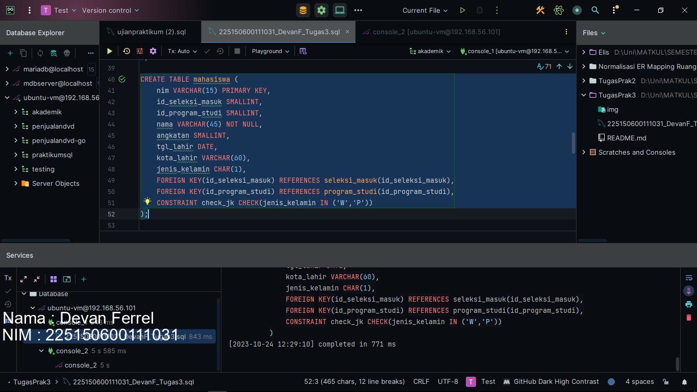
<br/>

8. Lalu kita masuk ke DMLnya. Kita masukkan 2 data ke dalam tabel fakultas dengan syntax berikut. Karena kita ingin menginputkan semua kolomnya, kita tidak perlu menentukan kolom apa saja yang masuk seperti ```INSERT INTO fakultas (id_fakultas, fakultas) VALUES ...```.
```
INSERT INTO fakultas VALUES
(1, 'Ekonomi dan Bisnis'),
(2, 'Ilmu Komputer');
```
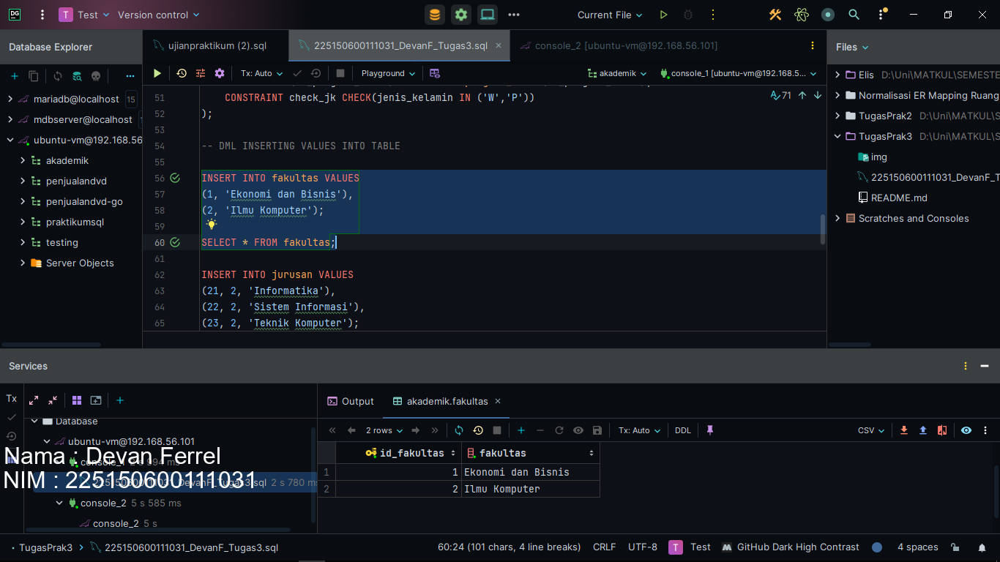
<br/>

9. Kita masukkan 3 data ke dalam tabel fakultas menggunakan INSERT dengan syntax berikut. 
```
INSERT INTO jurusan VALUES
(21, 2, 'Informatika'),
(22, 2, 'Sistem Informasi'),
(23, 2, 'Teknik Komputer');
```
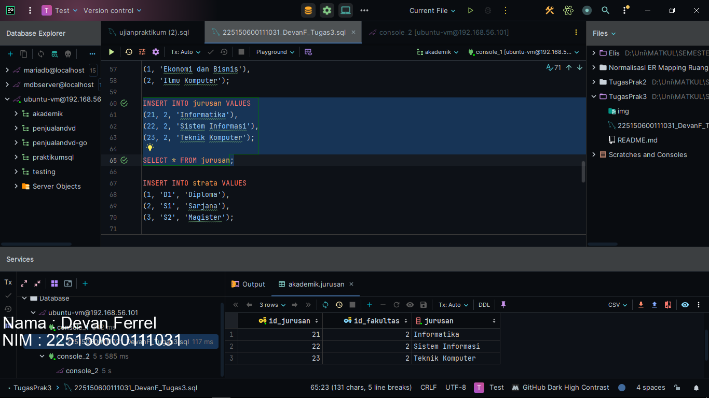
<br/>

10. Kita masukkan 3 data ke dalam tabel strata menggunakan INSERT dengan syntax berikut. 
```
INSERT INTO strata VALUES
(1, 'D1', 'Diploma'),
(2, 'S1', 'Sarjana'),
(3, 'S2', 'Magister');
```
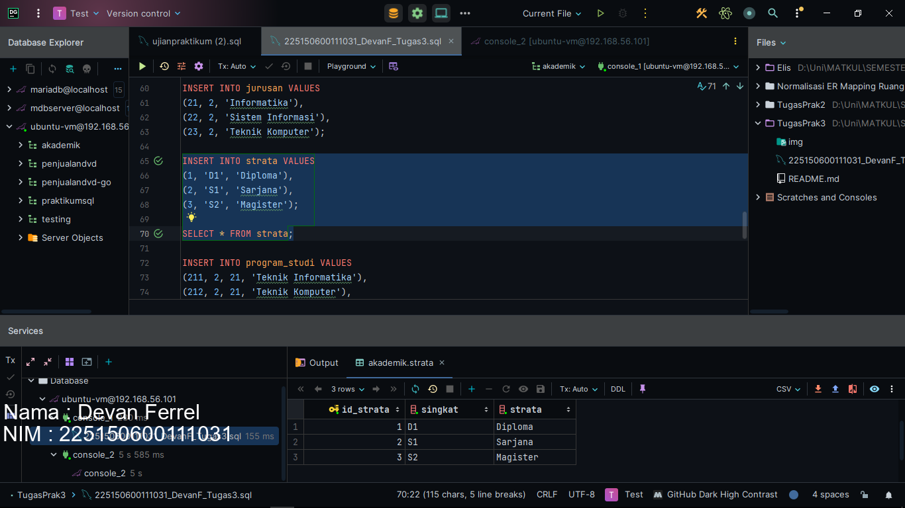
<br/>

11. Kita masukkan 3 data ke dalam tabel program_studi menggunakan INSERT dengan syntax berikut. 
```
INSERT INTO program_studi VALUES
(211, 2, 21, 'Teknik Informatika'),
(212, 2, 21, 'Teknik Komputer'),
(219, 3, 21, 'Magister Ilmu Komputer');
```
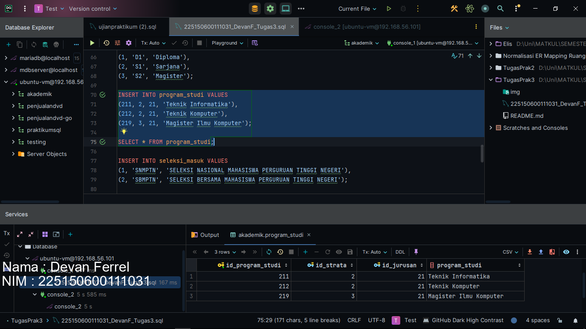
<br/>

12. Saat kita mencoba untuk melakukan penambahan data ke tabel seleksi_masuk dengan syntax berikut
```
INSERT INTO seleksi_masuk VALUES
(1, 'SNMPTN', 'SELEKSI NASIONAL MAHASISWA PERGURUAN TINGGI NEGERI'),
(2, 'SBMPTN', 'SELEKSI BERSAMA MAHASISWA PERGURUAN TINGGI NEGERI');
```
Kita mendapatkan error sebagai berikut, dimana terlihat bahwa data yang ingin dimasukkan terlalu kepanjangan.
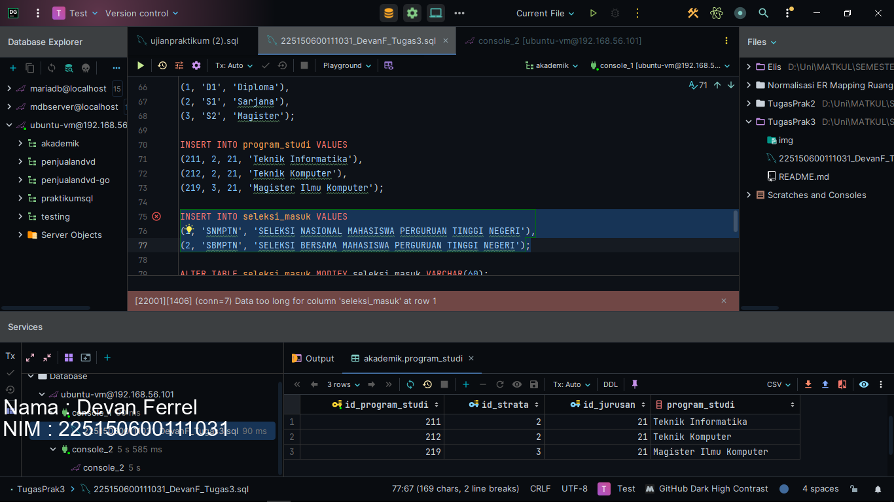
<br/>

Kita bisa memperbaiki ini dengan mengubah panjang varcharnya menjadi 60 dengan menggunakan alter dengan syntax berikut.
```
ALTER TABLE seleksi_masuk MODIFY seleksi_masuk VARCHAR(60);
```
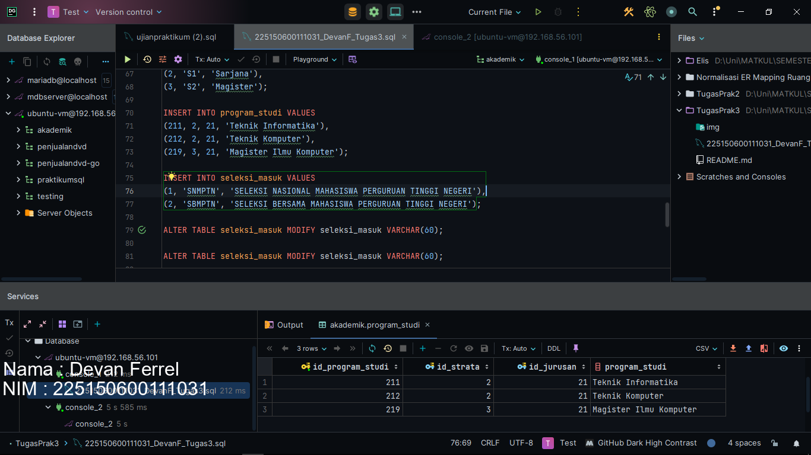

Lalu kita coba untuk menjalankan script sqlnya lagi dan bisa.
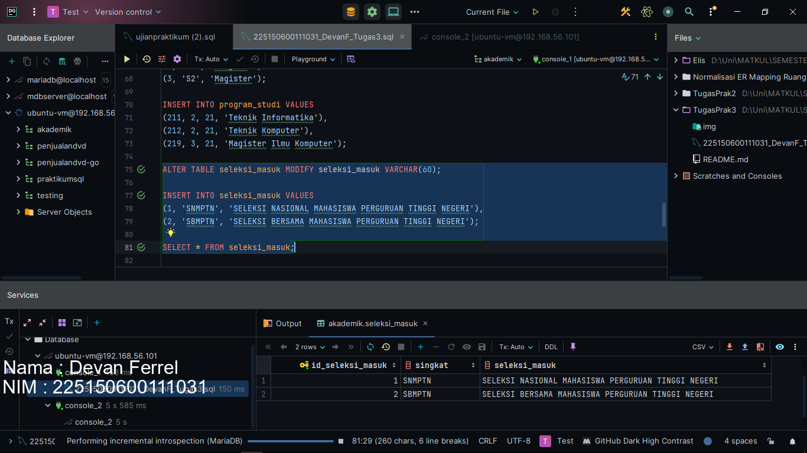

<br/>

13. Kita masukkan 7 data ke dalam tabel mahasiswa dengan syntax berikut.
```
INSERT INTO mahasiswa VALUES
(155150400, 1, 211, 'Putri', 2015, '1997-1-1', 'Malang', 'W'),
(155150401, 1, 211, 'Jono', 2015, '1997-10-2', 'Situbondo', 'P'),
(155150402, 2, 211, 'Bocchi', 2017, '1999-9-17', 'Tokyo', 'W'),
(155150403, 2, 212, 'Ryo', 2017, '1999-4-18', 'Tokyo', 'W'),
(155150404, 2, 212, 'Dengklek', 2016, '1998-5-4', 'Surabaya', 'P'),
(155150405, 2, 212, 'Joni', 2016, '1998-5-4', 'Bekasi', 'P'),
(155150406, 2, 211, 'Dodi', 2016, '1998-5-4', 'Bekasi', 'P');
```
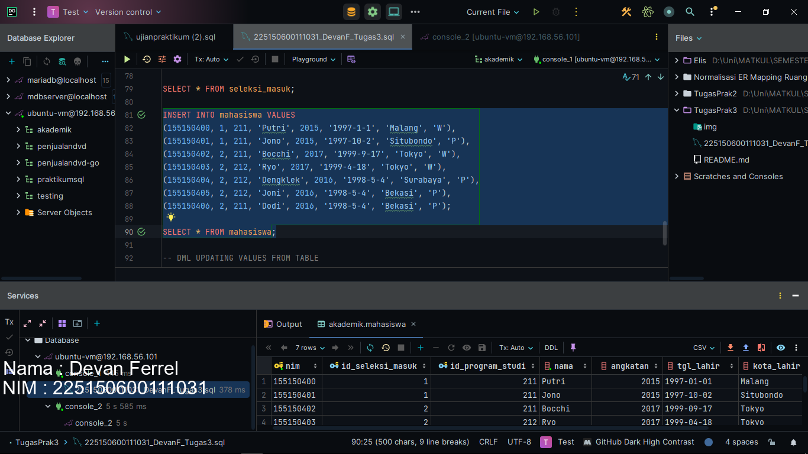
<br/>

14. Lalu kita coba untuk mengupdate tabel mahasiswa, dimana kita mengupdate nilai dari kolom id_program_studi menjadi 219 dengan klausa WHERE nilai dari kolom nama adalah Putri dengan syntax berikut.
```
UPDATE mahasiswa SET id_program_studi = 219 WHERE nama = 'Putri';
```
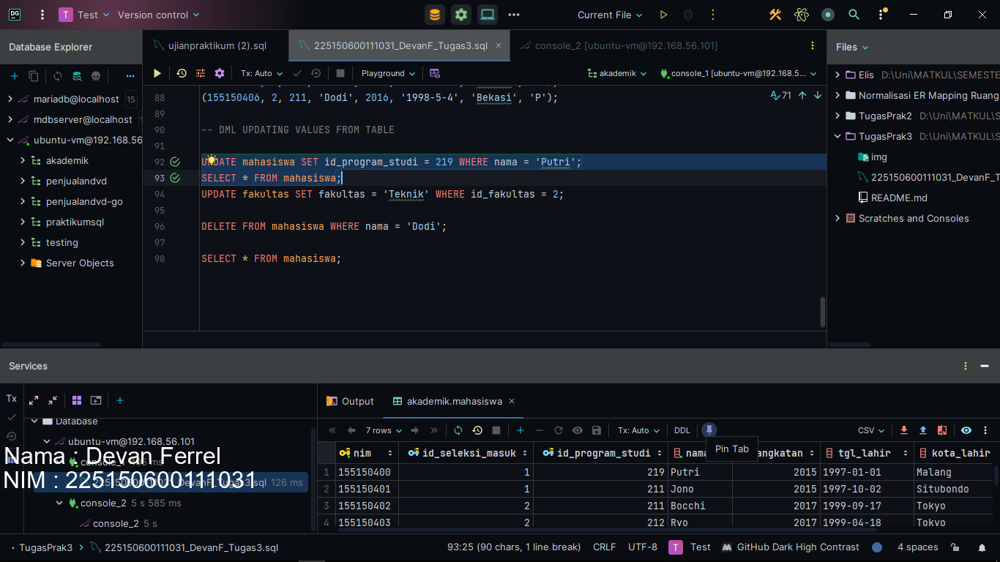
<br/>

15. Lalu kita coba untuk mengupdate tabel fakultas, dimana kita mengubah nilai dari fakultas yang pada awalnya ilmu komputer menjadi teknik dengan klausa WHERE nilai dari kolom id_fakultas adalah 2 dengan syntax berikut.
```
UPDATE fakultas SET fakultas = 'Teknik' WHERE id_fakultas = 2;
```
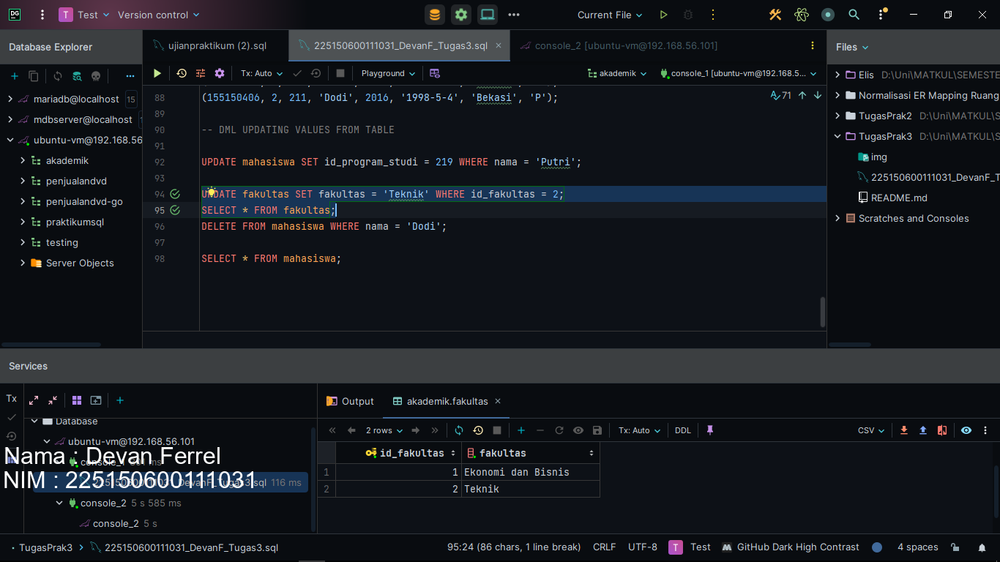
<br/>

16. Kita hapus Dodi dari tabel mahasiswa karena dia sudah pindah ke UI dengan menggunakan DELETE FROM dan tambahkan klausa WHERE kolom nama adalah Dodi. Apabila tidak ada klausa WHERE pada script DELETE FROM seperti ```DELETE FROM mahasiswa```, maka script ini akan menghapus semua data tanpa syarat pada tabel mahasiswa. Lakukan dengan syntax berikut.
```
DELETE FROM mahasiswa WHERE nama = 'Dodi';
```
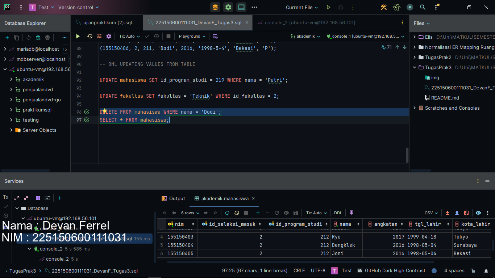
<br/>