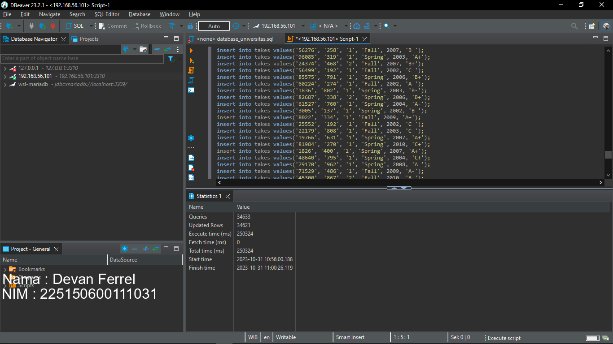
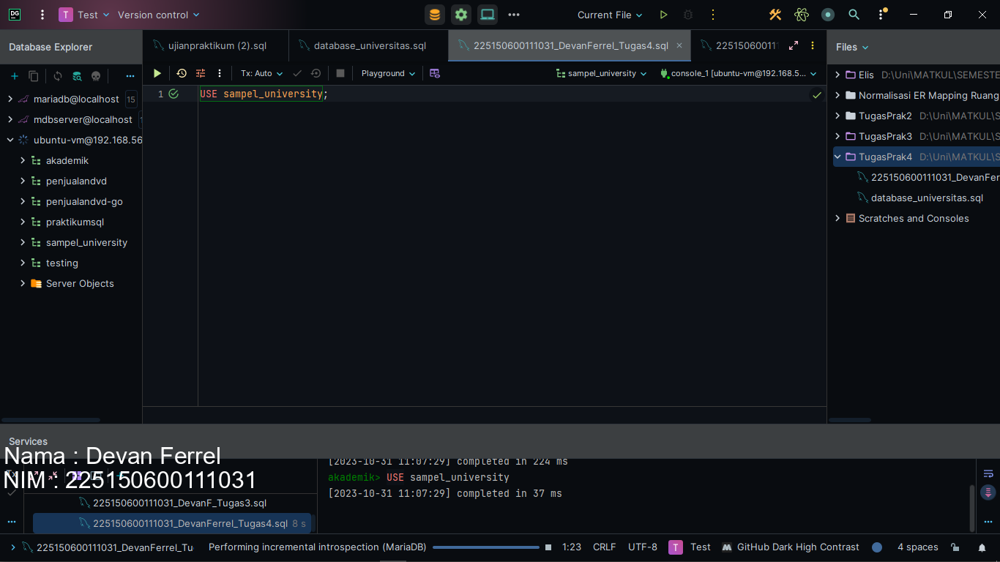
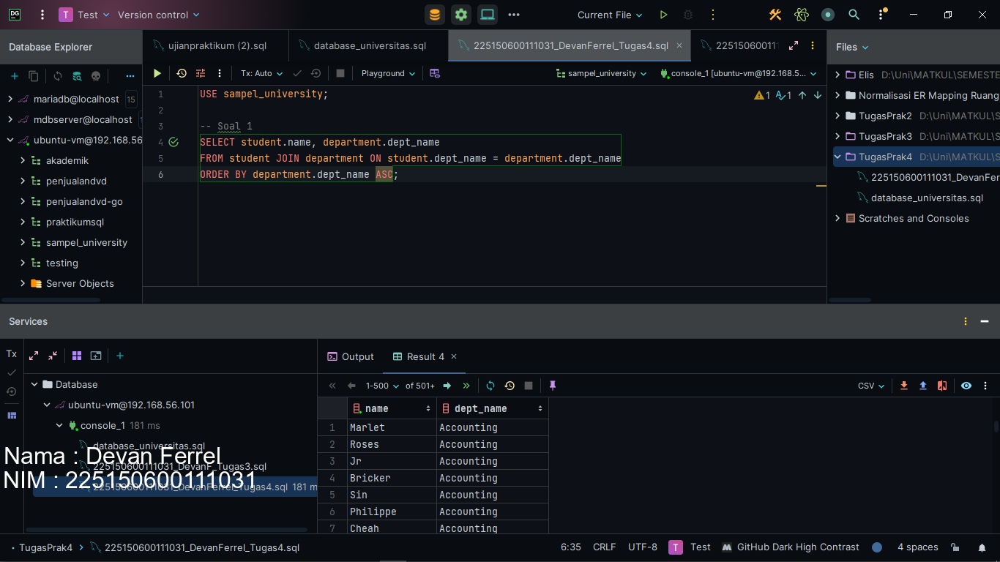
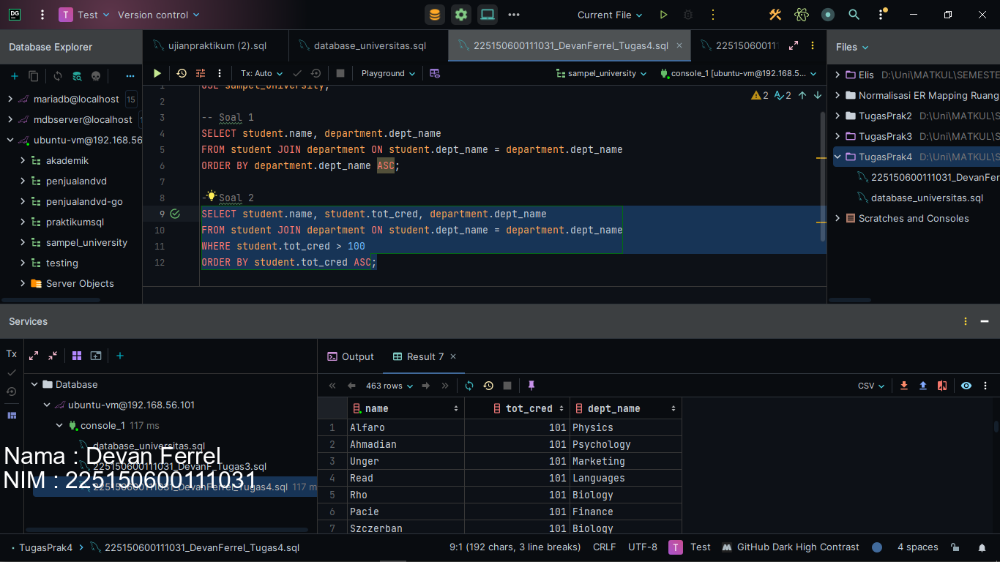
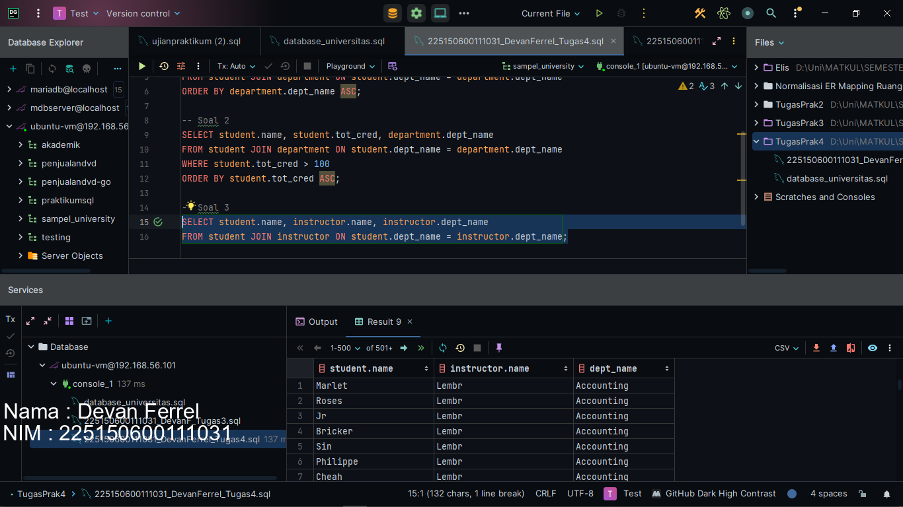

# 📁 Praktikum 4 : SQL Join

### [Kode Script SQL](./225150600111031_DevanFerrel_Tugas4.sql)    

Berikut merupakan langkah-langkah untuk mengerjakan tugas praktikum bab 3 mata kuliah Desain dan Basis Data SQL mengenai Data Manipulation Language.

### 📝 Langkah Percobaan

1. Pertama-tama, kita akan melakukan eksekusi query yang sudah disediakan oleh para asprak tercinta kita. Query tersebut berisikan DDL seperti create tabel dan DML seperti memasukkan 30 ribu data


2. Lalu setelah semau querynya sudah dieksekusi, kita akan lanjut ke soal. Sebelumnya, kita harus mengeksekusi query use database untuk mempermudah kita melakukan query dengan syntax berikut
```
USE sampel_university;
```



3. Pada soal pertama, kita disuruh untuk menampilkan semau nama mahasiswa beserta nama departementnya. Kita bisa menggunakan select seperti biasa atau menggunakan join dengan syntax berikut. Kita akan melakukan join pada foreign key student.dept_name dengan primary key departement.dept_name lalu mengurutkannya berdasarkan dept_name secara menaik.
```
SELECT student.name, department.dept_name
FROM student JOIN department ON student.dept_name = department.dept_name
ORDER BY department.dept_name ASC;
```


4. Lanjut ke soal kedua, kita akan menampilkan nama student beserta nama departement yang memiliki total sks lebih dari 100. Untuk mendapatkan hasil tersebut, kita bisa menjalankan query berikut. Query berikut mirip dengan query sebelumnya, hanya saja, kita akan menambahkan select student.tot_cred untuk membuktikan bahwa kita sudah mendapatkan nama murid yang memiliki total credit lebih dari 100. Lalu kita juga tambahkan kondisi klausa WHERE dimana student.tot_cred lebih dari 100. Kita akan order by kolom student.tot_cred secara menaik.
```
SELECT student.name, student.tot_cred, department.dept_name
FROM student JOIN department ON student.dept_name = department.dept_name
WHERE student.tot_cred > 100
ORDER BY student.tot_cred ASC;
```


5. Soal terakhir, kita akan menampilkan nama student dan nama instructor yang bekerja pada departement yang sama. Untuk meraih hasil tersebut, kita bisa melakukan query berikut. Query berikut akan melakukan join pada tabel instructor berdasarkan student.dept_nama sama dengan instructor.dept_name
```
SELECT student.name, instructor.name, instructor.dept_name
FROM student JOIN instructor ON student.dept_name = instructor.dept_name;
```
