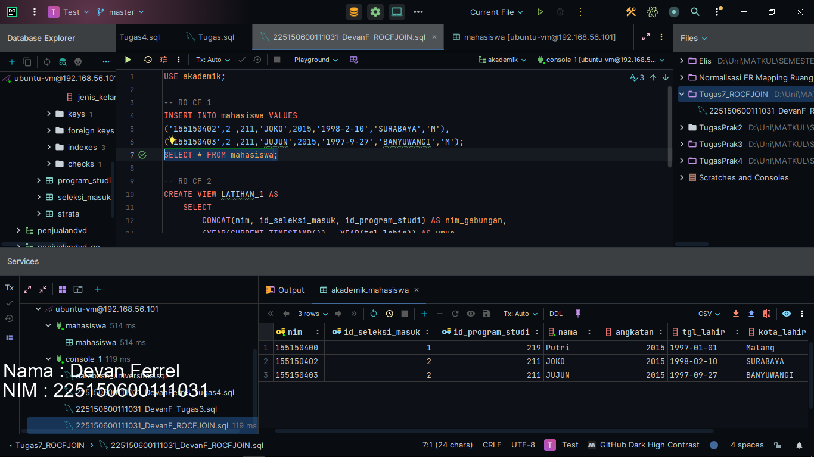

# 📁 Praktikum 4 : SQL Join

### [Kode Script SQL](./225150600111031_DevanF_ROCFJOIN.sql)    

Berikut merupakan langkah-langkah untuk mengerjakan tugas praktikum bab 4 mata kuliah Desain dan Basis Data SQL mengenai SQL ROCF and JOIN.

### 📝 Langkah Percobaan
1. Pertama-tama, kita akan menggunakan database akademik karena penugasan ini masih menggunakan database tugas sebelumnya dengan melakukan query seperti berikut.
```
USE akademik;
```


2. Setelah itu, kita akan melakukan insert 2 data ke tabel mahasiswa dengan syntax berikut. Kita gunakan query insert yang tanpa mengspefisikasikan kolom mana yang akan kita insert karena ini hanya sebatas tugas, bukan membangun aplikasi backend.
```
INSERT INTO mahasiswa VALUES
('155150402',2 ,211,'JOKO',2015,'1998-2-10','SURABAYA','M'),
('155150403',2 ,211,'JUJUN',2015,'1997-9-27','BANYUWANGI','M');
```


Hasilnya dapat dilihat dengan query select.


3. Lalu, kita akan membuat view bernama LATIHAN_1, dimana view ini merupakan tabel virtual yang biasanya berisi subdata dari satu, atau lebih tabel. View ini akan berisi kolom nim_gabungan dimana nim_gabungan merupakan nilai gabungan dari kolom nim, id_seleksi_masuk dan id_program_studi. Kita bisa melakukan penggabungan dengan fungsi concat dan namai hasil dari gabungan dengan AS. Untuk kolom umur, kita bisa dapatkan nilainya dari hasil kalkulasi tahun sekarang dikurangin dengan tahun lahir. Kita bisa mendapatkan nilai tahun dengan menggunakan fungsi YEAR dan mendapatkan tanggal sekarang dengan fungsi CURRENT_TIMESTAMP. Jangan lupa kita ganti nama kolomnya sebagai kolom umur. Dan terakhir tentunya kita ambil semua data ini dari tabel mahasiswa. Berikut querynya.
```
CREATE VIEW LATIHAN_1 AS
    SELECT
        CONCAT(nim, id_seleksi_masuk, id_program_studi) AS nim_gabungan,
        (YEAR(CURRENT_TIMESTAMP()) - YEAR(tgl_lahir)) AS umur
    FROM mahasiswa;
```
Berikut hasilnya


4. Lalu, kita akan membuat view lagi bernama LATIHAN_2. Sebelum itu, kita akan melakukan insert 2 data lagi dengan program studi dan angkatan berbeda untuk membuktikan bahwa view ini berhasil dengan query berikut.
```
INSERT INTO mahasiswa VALUES ('155150404', 1, 212, 'Dengklek', 2016, '1999-05-30', 'Bekasi', 'M');
INSERT INTO mahasiswa VALUES ('155150405', 1, 211, 'Alice', 2016, '1999-11-30', 'Bekasi', 'F');
```


Lalu setelah itu, kita buat viewnya dengan sebagai query select kolom id_program_studi, angkatan, dan kita gunakan fungsi agregasi count dan tandai sebagai coba (hehe lupa ganti, males ganti maap) dan kita ambil dari tabel mahasiswa dan kita group by id_program_studi dan angkatan dengan query berikut.
```
CREATE VIEW LATIHAN_2 AS
    SELECT
        id_program_studi, angkatan, COUNT(*) AS coba
    FROM mahasiswa
    GROUP BY id_program_studi, angkatan;
```


5. Lanjut ke tugas join, kita akan menampilkan nim, nama, angkatan, program_studi (bukan id), dan seleksi_masuk (bukan id) mahasiswa dari database. kita bisa mendapatkan hasil tersebut dengan melakukan join 2 tabel, yaitu tabel program_studi dan tabel seleksi_masuk. Kita lakukan dengan kondisi kolom pada tabel mahasiswa, id_program_studi sama dengan kolom pada tabel program_studi, id_program_studi dan juga hal yang sama dengan join tabel seleksi_masuk. Berikut syntax quernya.
```
SELECT
    mahasiswa.nim, mahasiswa.nama, mahasiswa.angkatan, program_studi.program_studi, seleksi_masuk.seleksi_masuk
    FROM mahasiswa
    JOIN program_studi ON mahasiswa.id_program_studi = program_studi.id_program_studi
    JOIN seleksi_masuk ON mahasiswa.id_seleksi_masuk = seleksi_masuk.id_seleksi_masuk;
```


6. Terakhir, untuk menampilkan kolom program_studi dan jurusannya beserta jurusan yang tidak memiliki program_studi, kita bisa menggunakan left join dari perspektif tabel jurusan dengan kondisi kolom id_jurusan pada tabel program_studi sama dengan kolom id_jurusan pada tabel jurusan. Berikut syntax querynya.
```
SELECT
    jurusan.jurusan, program_studi.program_studi
    FROM jurusan
    LEFT JOIN program_studi ON program_studi.id_jurusan = jurusan.id_jurusan;
```
