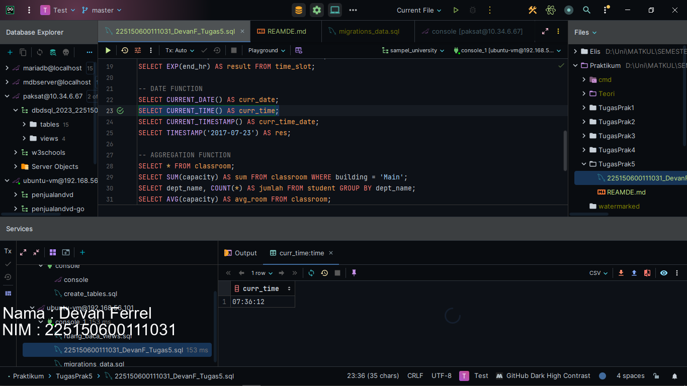
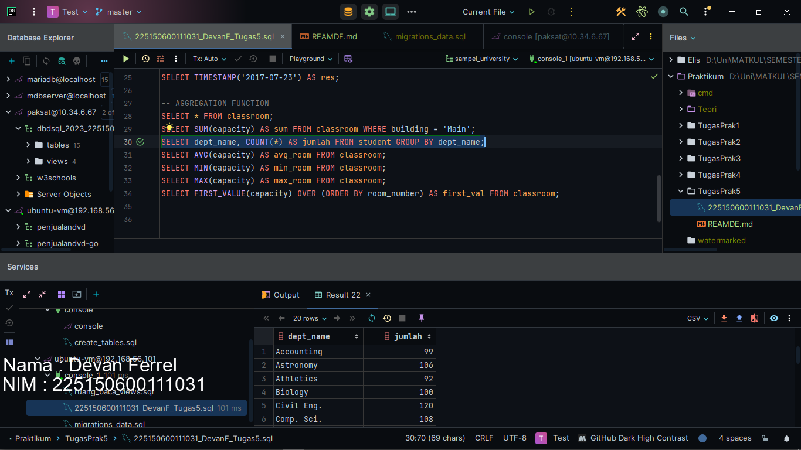

# 📁 Praktikum 5 : Fungsi Skalar dan Fungsi Agregasi

### [Kode Script SQL](./225150600111031_DevanF_Tugas5.sql) 

Berikut merupakan langkah-langkah untuk mengerjakan tugas praktikum bab 5 mata kuliah Desain dan Basis Data SQL mengenai Fungsi Skalar dan Fungsi Agregasi.

### 📝 Langkah Percobaan

1. Pada query pertama, kita akan mencoba untuk menggunakan fungsi concat pada sql. Fungsi concat akan menggabungkan semua nilai dengan tipe data varchar/char yang dimasukkan sebagai parameter menjadi 1 string. Berikut querynya.
```
SELECT CONCAT(ID, ' ', name) AS name FROM student;
```


2. Pada query kedua, kita akan mencoba untuk menggunakan fungsi substring_index yang ada pada mariadb. Fungsi substring_index sendiri menerima 3 parameter, yaitu nilai yang pengen diambil substringnya, string pemisah dan urutan pemisah. Jika nilai urutan pemisah positif, maka akan diambil dari depan dan sebaliknya jika nilai urutan pemisah negatif. Fungsi ini akan mengambil dari awal (kalau nilai urutan pemisah positif) / akhir (kalau nilai urutan pemisah negatif) sampai dia ketemu string pemisah ke urutan pemisah. Beriktu query dan contohnya.
```
SELECT SUBSTRING_INDEX(title, ' ', 1) AS result FROM course;
```


3. Pada query ketiga, kita akan mencoba fungsi substr pada mariadb.
Fungsi mariadb memiliki 3 parameter, nilai yang pengen diambil substringnya, indeks ke berapa dimulai pengambilan substringnya dan berapa panjang yang pengen kita ambil. Berikut querynya dan contohnya.
```
SELECT SUBSTR(title, 1, 5) AS substr FROM course;
```


4. Pada query keempat, ada fungsi length dimana fungsi length akan mengembalikan panjang suatu nilai apabila nilai tersebut merupakan varchar. Berikut contohnya
```
SELECT LENGTH(title) AS panjang FROM course;
```


5. Pada query kelima, ada fungsi replace yang bekerja sama seperti java replace, menggantikan suatu substring dengan string lainnya, untuk mariadb sendiri tentunya string yang dimaksud adalah varcahr. Berikut contohnya
```
SELECT DISTINCT REPLACE(title, 'ff', 'gg') AS result FROM course WHERE title LIKE '%ff%';
```


6. Pada query keenam, ada fungsi trim dimana fungsi trim ini akan memotong nilai berdasarkan parameternya. Ada 3 tipe trim, yaitu leading yang mana memotong karakter bagian awalnya saja, trailing yang mana memotong karakter bagian akhirnya saja dan both yang mana artinya dua2nya. Berikut contohnya
```
SELECT TRIM(BOTH 'ni' FROM building) FROM classroom WHERE building LIKE '%ni%';
```


7. Pada query ketujuh, ada fungsi upper yang fungsinya untuk membuat nilai varchar menjadi uppercase semua. berikut contohnya.
```
SELECT UPPER(title) AS judul_upper FROM course;
```


8. Pada query kedelapan, ada fungsi lower yang fungsinya untuk membuat nilai varchar menjadi lowercase semua. berikut contohnya.
```
SELECT UPPER(title) AS judul_upper FROM course;
```


9. Pada query kesembilan, ada fungsi abs alias absolut dimana fungsi ini akan membuat nilai negatif menjadi positif sementara positif ya tetap positif. berikut contohnya
```
SELECT ABS(start_min - end_min) AS result FROM time_slot;
```


10. Pada query kesepeluh, ada fungsi sum yang mana akan menjumlahkan semua nilai yang ada pada suatu kolom menjadi 1. berikut contohnya
```
SELECT SUM(end_hr) AS result FROM time_slot;
```


11. Pada query kesebelas, ada fungsi ceil yang mana akan membulatkan suatu bilangan float ke atas. berikut contohnya
```
SELECT CEIL(ABS(start_min - end_min) / 3) AS result FROM time_slot;
```


12. Pada query keduableas, ada fungsi floor yang mana akan membulatkan suatu bilangan float ke bawah. berikut contohnya
```
SELECT FLOOR(ABS(start_min - end_min) / 3) AS result FROM time_slot;
```


13. Pada query ketigabelas, ada fungsi floor yang mana akan membulatkan suatu bilangan float ke bawah. berikut contohnya
```
SELECT FLOOR(ABS(start_min - end_min) / 3) AS result FROM time_slot;
```


14. Pada query keempatbelas, ada fungsi round yang mana akan membulatkan suatu bilangan float tergantung apakah bilangan tersebut lebih dengan dengan bilangan - 1 atau bilangan + 1. Berikut contohnya.
```
SELECT ROUND(ABS(start_min - end_min) / 6) AS result FROM time_slot;
```


15. Pada query kelimabelas, ada fungsi sqrt yang mana akan mengembalikan nilai square root dari suatu nilai. Berikut contohnya.
```
SELECT SQRT(end_hr) AS result FROM time_slot;
```


16. Pada query keenambelas, ada fungsi mod yang mana fungsi akan melakukan modulo angka yang merupakan parameter pertama dengan angka yang merupakan parameter kedua sebagai divisor. Berikut querynya.
```
SELECT MOD(end_hr, 3) AS result FROM time_slot;
```


17. Pada query ketujuhbelas, ada fungsi exp yang mengembalikan hasil exponential suatu nilai yang kita taruh sebagai parameter. Berikut querynya.
```
SELECT CURRENT_DATE() AS curr_date;
```


18. Pada query kedelapanbelas, ada fungsi current_date yang akan mengembalikan tanggal sekarang. Berikut contohnya.
```
SELECT CURRENT_DATE() AS curr_date;
```


19. Pada query kesembilanbelas, ada fungsi current_time yang akan mengembalikan waktu jam sekarang. Berikut contohnya.
```
SELECT CURRENT_TIME() AS curr_time;
```


20. Pada query keduapuluh, kita mempunyai timestamp yang akan mengkonversikan varchar yang diberikan menjadi timestamp. Berikut contohnya
```
SELECT CURRENT_TIMESTAMP() AS curr_time_date;
```


21. Pada query keduapuluh satu, ada fungsi sum dimana fungsi ini akan menjumlahkan semua nilai yang ada dalam parameternya. Berikut contoh querynya.
```
SELECT SUM(capacity) AS sum FROM classroom WHERE building = 'Main';
```


22. Pada query lanjutnya, ada fungsi count dimana fungsi ini bisa menghitung jumlah baris yang nilai suatu kolomnya sama. Berikut contoh querynya
```
SELECT dept_name, COUNT(*) AS jumlah FROM student GROUP BY dept_name;
```


23. Pada query lanjutnya, ada fungsi avg dimana fungsi ini akan melakukan return nilai rata-rata dari parameter yang diberikan. Berikut contoh querynya.
```
SELECT AVG(capacity) AS avg_room FROM classroom;
```


24. Pada query lanjutnya, ada fungsi min dimana fungsi ini akan melakukan return nilai paling terkecil dari parameter yang diberikan. Berikut contoh querynya.
```
SELECT MIN(capacity) AS min_room FROM classroom;
```


23. Pada query lanjutnya, ada fungsi min dimana fungsi ini akan melakukan return nilai paling terbesar dari parameter yang diberikan. Berikut contoh querynya.
```
SELECT MAX(capacity) AS max_room FROM classroom;
```


24. Pada query terakhir, akhirnyaa selesai juga, ada fungsi first_value dimana fungsi ini akan mengembalikan nilai pertama dari kolom yang kita kasih sebagai parameter. Berikut contoh querynya.
```
SELECT FIRST_VALUE(capacity) OVER (ORDER BY room_number) AS first_val FROM classroom;
```
