# 📁 Praktikum 6 : Union dan Subquery

### [Kode Script SQL](./225150600111031_DevanF_Tugas5.sql) 

Berikut merupakan langkah-langkah untuk mengerjakan tugas praktikum bab 6 mata kuliah Desain dan Basis Data SQL mengenai Union dan Subquery

### 📝 Langkah Percobaan
1. Pertama, kita akan mengerjakan bagian yang subquery terlebih dahulu. Sebelum menulis script sql yang berkaitan dengan union, kita akan melakukan beberapa query yang sudah disediakan oleh soal. Query pertama yang sudah disediakan yaitu melakukan insert ke dalam tabel mahasiswa dengan syntax query berikut.
```
INSERT INTO mahasiswa VALUES
    ('155150404', 1,212,'JESSY',2016,'1999-2-10','BANDUNG','F'),
    ('155150405', 2 ,219,'BAMBANG',2014,'1996-9-27','MAKASSAR','M');

SELECT * FROM mahasiswa;
```
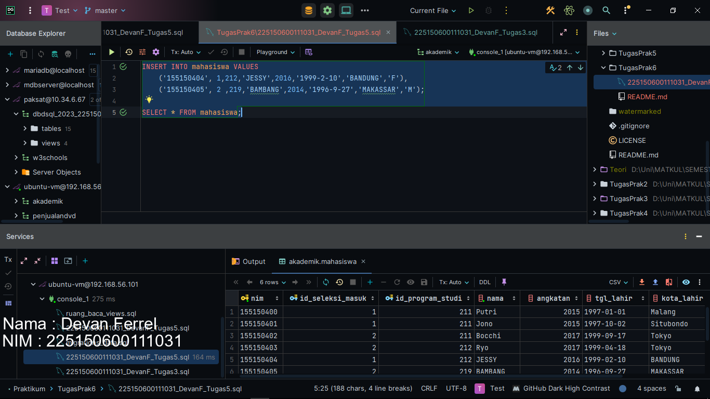

2. Lalu kita akan membuat tabel bernama mahasiswa_pindahan dengan kolom dan tipe data yang sudah disediakan oleh soal. Berikut syntax dan querynya.
```
CREATE TABLE mahasiswa_pindahan (
    nim VARCHAR(15) PRIMARY KEY NOT NULL,
    id_seleksi_masuk SMALLINT,
    id_program_studi SMALLINT,
    nama VARCHAR(45),
    angkatan SMALLINT,
    tgl_lahir DATE,
    kota_lahir VARCHAR(60),
    jenis_kelamin CHAR(1) CHECK(jenis_kelamin IN ('F', 'M')),
    FOREIGN KEY(id_seleksi_masuk) REFERENCES seleksi_masuk(id_seleksi_masuk),
    FOREIGN KEY(id_program_studi) REFERENCES program_studi(id_program_studi)
);
```
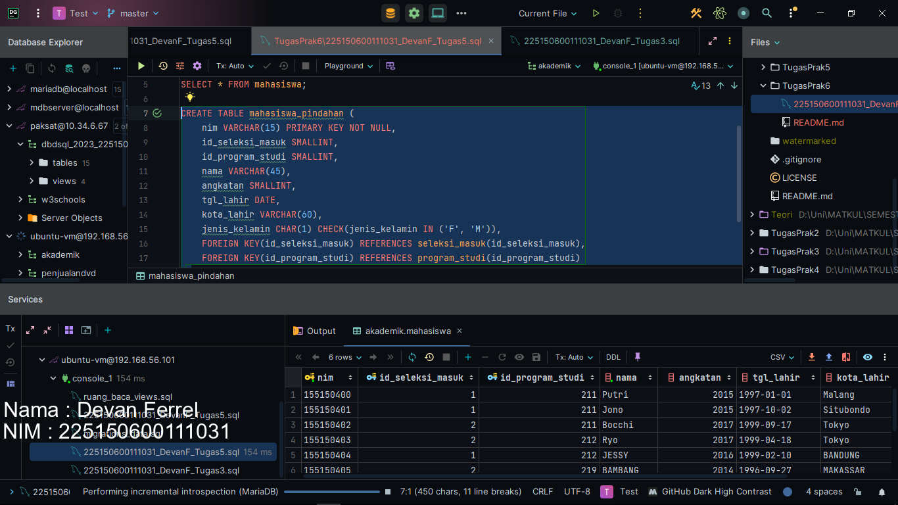

3. Lanjut ke query ke tiga, kita akan melakukan insert beberapa data ke dalam tabel mahasiswa_pindahan. Berikut query dan syntaxnya.
```
INSERT INTO mahasiswa_pindahan VALUES
('155150500', 1 ,211,'BUDI', 2015,'1997-3-3','BANYUWANGI','M'),
('155150501', 2,212,'ANDI',2015,'1997-2-21','JAKARTA','M'),
('155150502', 2 ,211,'DIMAS', 2015,'1998-4-11','SURABAYA','M'),
('155150503', 2 ,211,'DIDIN',2015,'1997-2-26','BANDUNG','M');
```
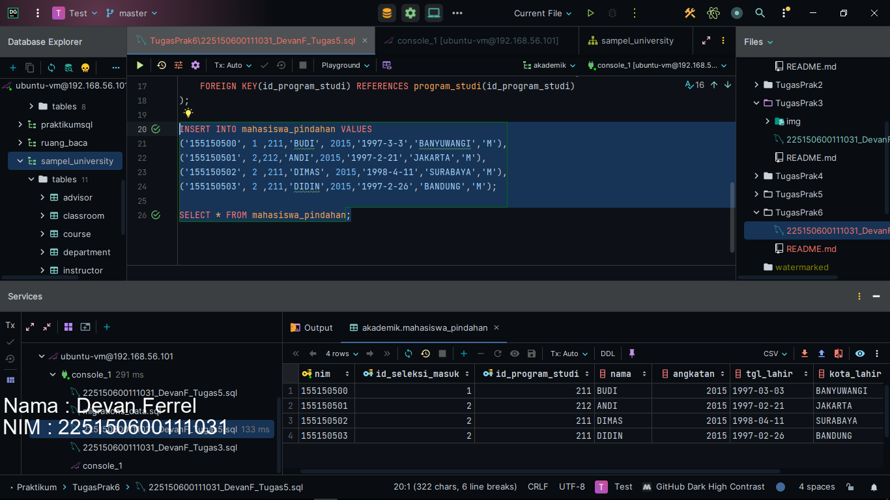

4. Lanjut pada soal pertama yang kita hadapi, kita disuruh untuk menampilkan nim, nama, angkatan dari tabel mahasiswa yang memiliki tabel yang sama dengan mahasiswa pindahan yang bernama Budi. Sebelum kita menulis query jawabannya, kita akan mencoba untuk menginsert beberapa data ke dalam tabel mahasiswa dengna syntax query berikut.
```
INSERT INTO mahasiswa VALUES
    ('155150407', 1,212,'HARTONO',2016,'1999-2-10','BANYUWANGI','M'),
    ('155150408', 2 ,219,'DENGKLEK',2014,'1996-9-27','BANYUWANGI','M');
```
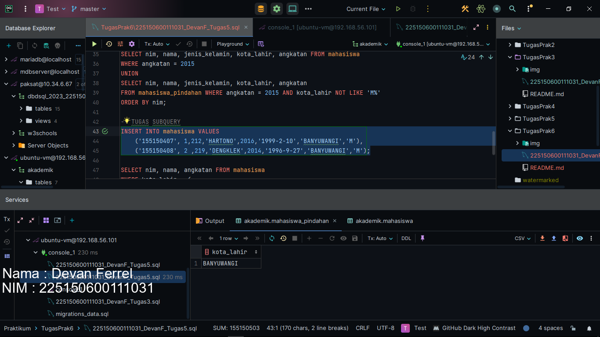

Lanjut, kita akan menulis query jawabannya. Dari keterangan soal ini, sepertinya subquery yang dimaksud masuk ke kategori baris tunggal, karena baris yang akan dikembalikan dari subquery hanya akan ada 1, kota lahir Budi. Kita akan menggunakan query berikut sebagai subquery kita.
```
SELECT kota_lahir FROM mahasiswa_pindahan WHERE nama = 'BUDI'
```
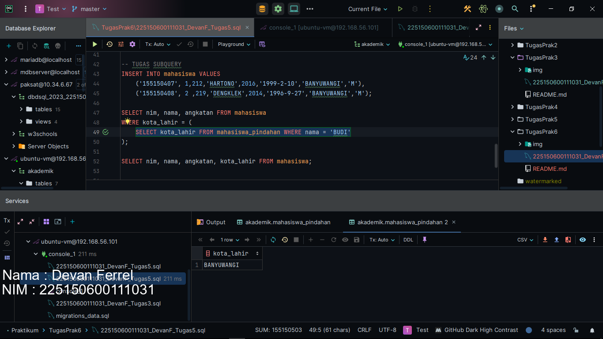
Dapat dilihat, kita hanya mendapatkan 1 baris, yaitu Banyuwangi.
Lanjut kita akan melakukan select 3 kolom dari tabel mahasiswa dimana kota lahir sama dengan hasil yang didapatkan dari subquery. Karena subquerynya mengembalikan 1 baris, maka kita bisa menggunakan operasi sama dengan seperti query berikut.
```
SELECT nim, nama, angkatan FROM mahasiswa
WHERE kota_lahir = (
    SELECT kota_lahir FROM mahasiswa_pindahan WHERE nama = 'BUDI'
);
```
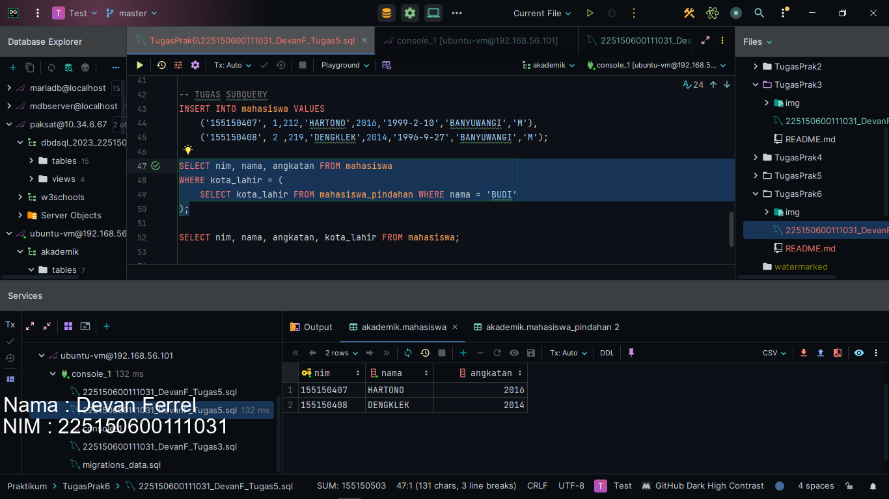

5. Lanjut mirip sama dengan sebelumnya, hanya saja kota lahir mahasiswa yang sama dengan kota lahir mahasiswa pindahan. Bisa ditebak bahwa subquery pada soal ini adalah baris ganda, karena mengembalikan semua baris kota_lahir yang terdapat pada tabel mahasiswa_pindahan. Berikut query yang kita gunakan sebagia subquery.
```
SELECT kota_lahir FROM mahasiswa_pindahan
```
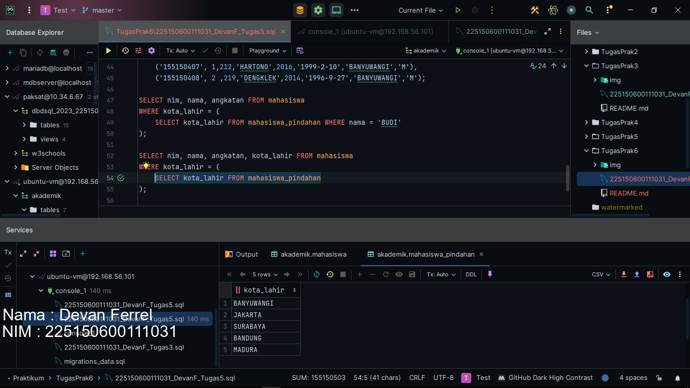

Lanjut, kita tinggal melakukan select 3 kolom dan karena kita ingin buktikan query ini benar, kita tambahkan 1 kolom lagi untuk diselect dari tabel mahasiswa dimana kolom kota_lahir terdapat pada hasil subquery. Karena hasil subquerynya memiliki baris ganda, kita tidak bisa menggunakan operator sama dengan, tetapi bisa menggunakan ```IN``` seperti query berikut.
```
SELECT nim, nama, angkatan, kota_lahir FROM mahasiswa
WHERE kota_lahir IN (
    SELECT kota_lahir FROM mahasiswa_pindahan
);
```
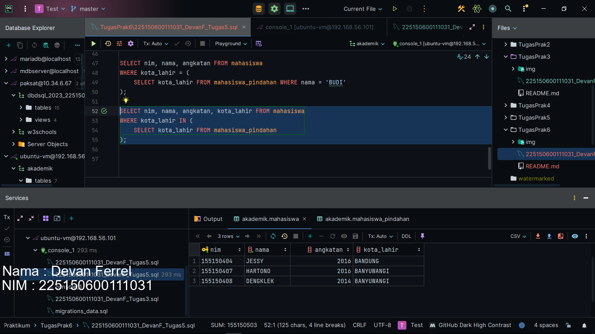

6. Lanjut kita pindah ke soal union, pada soal pertama, kita disuruh untuk menampilkan nim, nama, jenis kelamin, kota_lahir dan angkatan dari mahasiswa yang memiliki Kota Lahir dengan inisial B dan dari Mahasiswa_Pindahan yang memiliki Nama
dengan inisial D lalu diurutkan berdasarkan NIM.      
Perlu dicatat, bahwa untuk union, kolom yang diselect dari 2 tabel harus memiliki nama kolom yang sama serta tipe data yang sama. Untuk query pertama, bisa dijabarkan dengan kode berikut. Kita gunakan seleksi klausa where kota_lahir LIKE 'B%' yang berarti kota_lahir memiliki kata B pada inisialnya seperti Bojonegoro, Bandung, Bogor, Bekasi dll. 
```
SELECT nim, nama, jenis_kelamin, kota_lahir, angkatan FROM mahasiswa
WHERE kota_lahir LIKE 'B%'
```
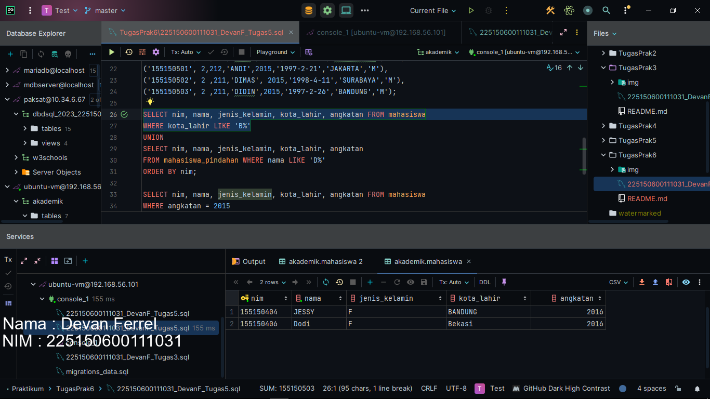
Untuk query kedua, bisa dijabarkan dengan kode yang hampir mirip, hanya saja beda tabel dan beda kondisi klausa where.
```
SELECT nim, nama, jenis_kelamin, kota_lahir, angkatan
FROM mahasiswa_pindahan WHERE nama LIKE 'D%'
```
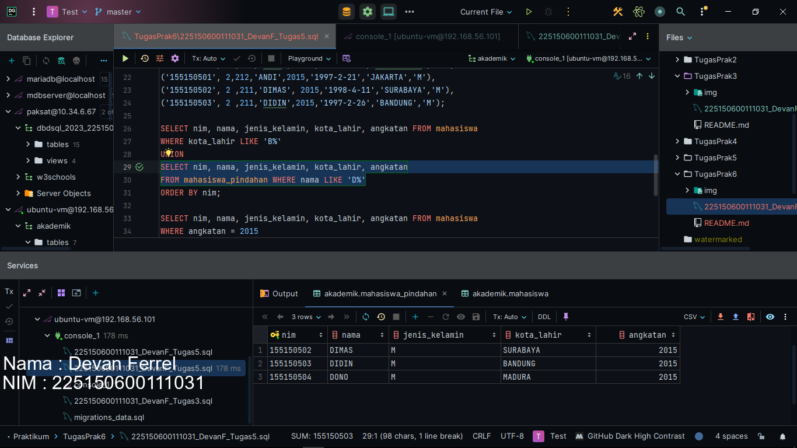
Apabila kita gabungkan dengan union akan menghasilkan tampilan berikut.
```
SELECT nim, nama, jenis_kelamin, kota_lahir, angkatan FROM mahasiswa
WHERE kota_lahir LIKE 'B%'
UNION
SELECT nim, nama, jenis_kelamin, kota_lahir, angkatan
FROM mahasiswa_pindahan WHERE nama LIKE 'D%'
ORDER BY nim;
```
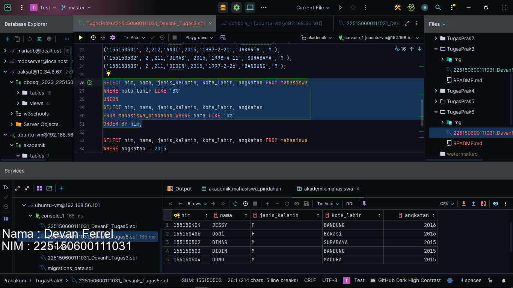

7. Lanjut akhirnya soal terkahir dari tugas laporan praktikum terkahir mata kuliah DBDSQL, semoga pemweb tidak kea gini, gaperlu laprak. Kita disuruh untuk menampilkan kolom nim, nama, jenis_kelamin, kota_lahir dan angaktan dari Mahasiswa
angkatan 2015 dan dari mahasiswa_pindahan tetapi kecuali mahasiswa_pindahan yang
memiliki Kota Lahir dengan inisial M urutkan berdasarkan NIM.     
Pada query pertama kita, kita akan melakukan select kolom-kolom dari tabel mahasiswa sesuai request dan menggunakan klausa where angkatan adalah 2015. Lalu kita kasih response kepada client kita.
```
SELECT nim, nama, jenis_kelamin, kota_lahir, angkatan FROM mahasiswa
WHERE angkatan = 2015
```
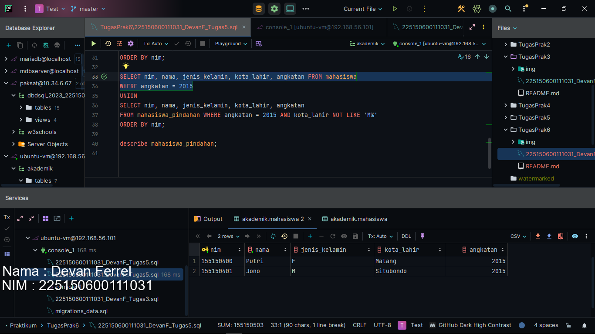
Lalu untuk query ketiga, kolom yang direquest juga sama dengan kolom yang direquest pada query sebelumnya. Hanya saja, lagi-lagi beda tabel yang digunakan, mahasiswa_pindahan dan penambahan kondisi untuk klausa where karena kita tidak ingin kota_lahirnya ada inisial M. (Waduh M tuh seberang S ya). Berikut query kedua.
```
SELECT nim, nama, jenis_kelamin, kota_lahir, angkatan
FROM mahasiswa_pindahan WHERE angkatan = 2015 AND kota_lahir NOT LIKE 'M%'
```
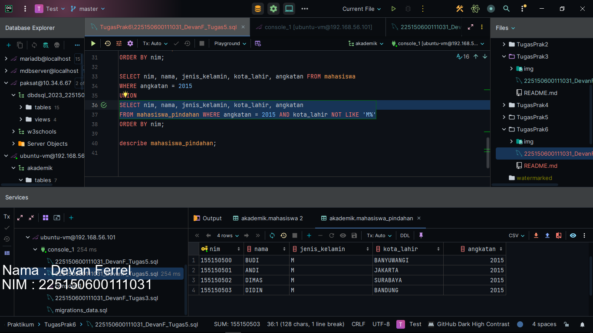
Apabila kita gabungkan dengan union akan menghasilkan hasil berikut.
```
SELECT nim, nama, jenis_kelamin, kota_lahir, angkatan FROM mahasiswa
WHERE angkatan = 2015
UNION
SELECT nim, nama, jenis_kelamin, kota_lahir, angkatan
FROM mahasiswa_pindahan WHERE angkatan = 2015 AND kota_lahir NOT LIKE 'M%'
ORDER BY nim;
```
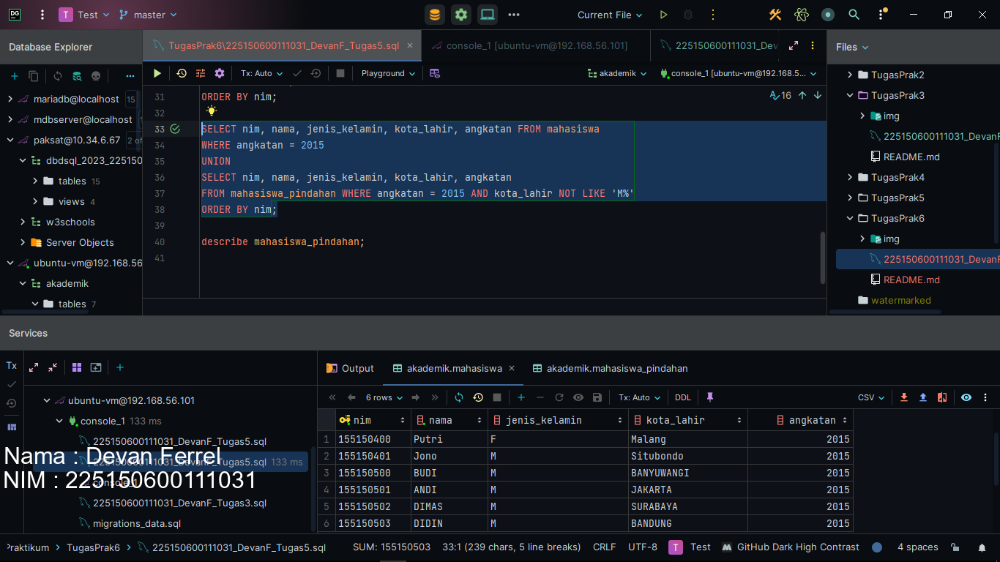
